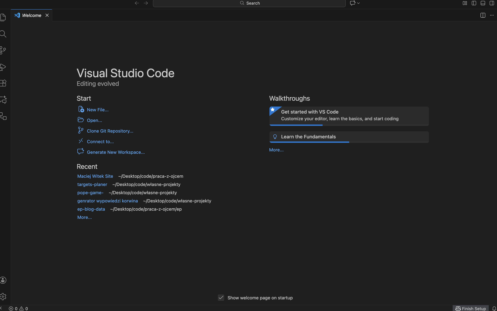
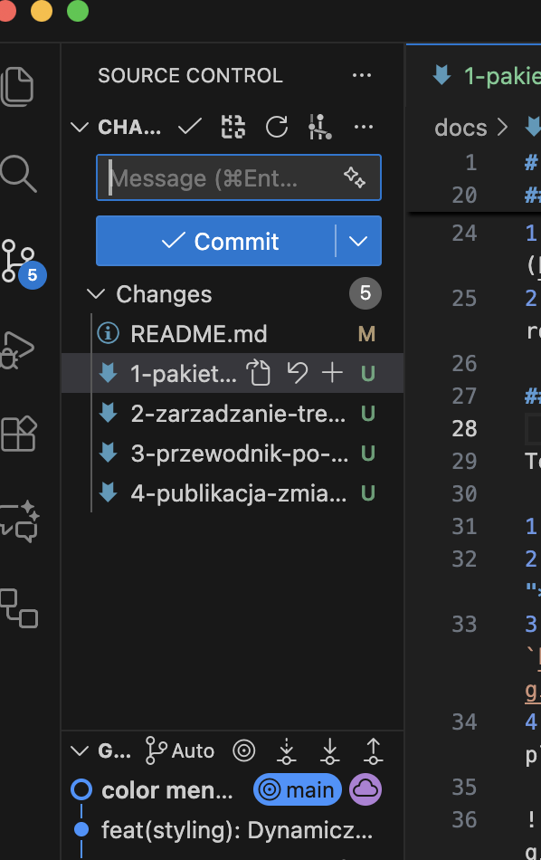
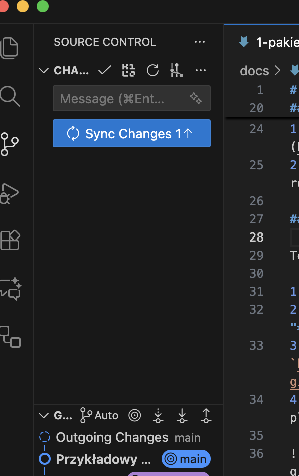

# Krok 4: Jak opublikować zmiany?

Gdy wprowadzisz już wszystkie zmiany i zapiszesz pliki, ostatnim krokiem jest ich publikacja. Dzięki temu staną się widoczne na publicznej stronie internetowej. Cały proces przeprowadzisz wygodnie wewnątrz VS Code.

### 4.1. Przejdź do panelu kontroli wersji

1.  W panelu po lewej stronie okna VS Code kliknij ikonę przedstawiającą rozgałęzienie (trzecia od góry).
2.  Otworzy się panel **"Source Control"**, w którym zobaczysz listę wszystkich zmodyfikowanych przez Ciebie plików.

### 4.2. Opisz i zatwierdź zmiany (Commit)

Teraz należy zapisać Twoje zmiany w postaci "paczki" z krótkim opisem.

1.  W polu tekstowym **"Message"** wpisz krótko, co zostało zmienione, np. "Dodanie nowego projektu" lub "Poprawki w biografii".
2.  Kliknij przycisk **"Commit"**.

*Wskazówka: Jeśli program zapyta Cię o "staging" zmian, wybierz "Yes". To standardowy element procesu, którym nie musisz się przejmować.*

### 4.3. Zsynchronizuj zmiany z serwerem (Sync Changes)

Ostatni etap to wysłanie przygotowanej "paczki" na serwer.

1.  Po zatwierdzeniu zmian, na niebieskim pasku na samym dole okna VS Code pojawi się przycisk **"Sync Changes"**, zwykle z ikoną kręcących się strzałek.
2.  Kliknij go, aby wysłać swoje zmiany.

Po chwili synchronizacja się zakończy. Twoje modyfikacje zostały opublikowane i wkrótce pojawią się na stronie.